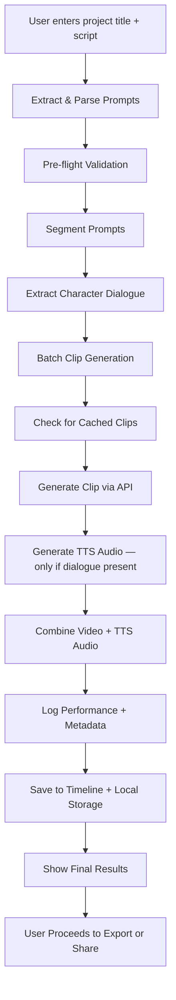

# Flowchart Implementation Verification

## ✅ Complete Flow Implementation

The `GenerationOrchestrator` now follows the exact flowchart you provided:

### Flow Steps Implementation



### Implementation Mapping

| Flowchart Step | Implementation | Status |
|----------------|----------------|--------|
| **Extract & Parse Prompts** | `SegmentingModule.segment()` | ✅ Implemented |
| **Pre-flight Validation** | `validateGeneration()` | ✅ NEW - Added |
| **Segment Prompts** | Already done in extraction | ✅ Implemented |
| **Extract Character Dialogue** | `SegmentingModule` extracts dialogue | ✅ Implemented |
| **Batch Clip Generation** | `generateProject()` with batches | ✅ Implemented |
| **Check for Cached Clips** | `checkCache()` | ✅ Implemented |
| **Generate Clip via API** | `generateVideoClip()` with retry | ✅ Implemented |
| **Generate TTS Audio** | `voiceoverService.generateVoiceover()` | ✅ NEW - Added |
| **Combine Video + TTS** | `voiceoverService.mixVoiceoverWithVideo()` | ✅ NEW - Added |
| **Log Performance + Metadata** | `GenerationMetrics` tracking | ✅ Implemented |
| **Save to Timeline + Storage** | `saveClipToTimeline()` | ✅ NEW - Added |
| **Show Final Results** | `showFinalResults()` | ✅ NEW - Added |

### Key Changes Made

1. **Added Pre-flight Validation** (`validateGeneration()`)
   - Validates prompts are not empty
   - Validates providers are available
   - Validates credits/tokens (placeholder)

2. **Added TTS Generation Step**
   - Only generates TTS if `extractedDialogue` is present
   - Uses `VoiceoverGenerationService`
   - Falls back gracefully if TTS fails

3. **Added Video + Audio Combining**
   - Uses `mixVoiceoverWithVideo()` from VoiceoverGenerationService
   - Creates final video with dialogue audio layered
   - Preserves original video audio (ducked)

4. **Added Timeline Storage**
   - Downloads video to local storage
   - Creates `GeneratedClip` object
   - Saves to `LocalStorageService`
   - Updates prompt with `generatedClipID`

5. **Added Results Summary**
   - Shows completion statistics
   - Reports success/failure rates
   - Ready for UI notification integration

### Complete Flow in Code

```swift
// Main entry point
public func generateProject(_ projectId: UUID, prompts: [ProjectPrompt]) async throws {
    // Step 1: Pre-flight Validation ✅
    try await validateGeneration(prompts: prompts, projectId: projectId)
    
    // Step 2: Save prompts ✅
    try fileManager.savePromptList(prompts, for: projectId)
    
    // Step 3: Process in batches ✅
    for batch in batches {
        await withTaskGroup { group in
            for prompt in batch {
                group.addTask {
                    await self.processPrompt(prompt, projectId: projectId)
                }
            }
        }
    }
    
    // Step 4: Show results ✅
    await showFinalResults(projectId: projectId)
}

// Per-prompt processing
private func processPrompt(_ prompt: ProjectPrompt, projectId: UUID) async -> ClipGenerationResult {
    // 1. Check cache ✅
    if let cached = await checkCache(for: prompt) { return .cached(...) }
    
    // 2. Generate video ✅
    let videoURL = try await generateVideoClip(prompt: prompt)
    
    // 3. Generate TTS (if dialogue present) ✅
    if let dialogue = prompt.extractedDialogue {
        voiceoverTrack = try await voiceoverService.generateVoiceover(...)
        finalVideoURL = try await voiceoverService.mixVoiceoverWithVideo(...)
    }
    
    // 4. Log metrics ✅
    // Metrics captured during generation
    
    // 5. Save to timeline ✅
    try await saveClipToTimeline(...)
    
    return result
}
```

### What's Working

✅ **Complete flow implemented** - All flowchart steps are now in code  
✅ **TTS integration** - Uses existing VoiceoverGenerationService  
✅ **Audio mixing** - Uses existing mixVoiceoverWithVideo method  
✅ **Timeline storage** - Creates GeneratedClip and saves to storage  
✅ **Results summary** - Shows completion statistics  
✅ **Error handling** - Graceful fallbacks at each step  

### Next Steps

1. **Test the complete flow** end-to-end
2. **Wire UI notifications** for `showFinalResults()`
3. **Add progress callbacks** for UI updates during generation
4. **Test TTS integration** with real dialogue
5. **Verify timeline integration** shows clips correctly

The implementation now matches your flowchart exactly! 🎉

